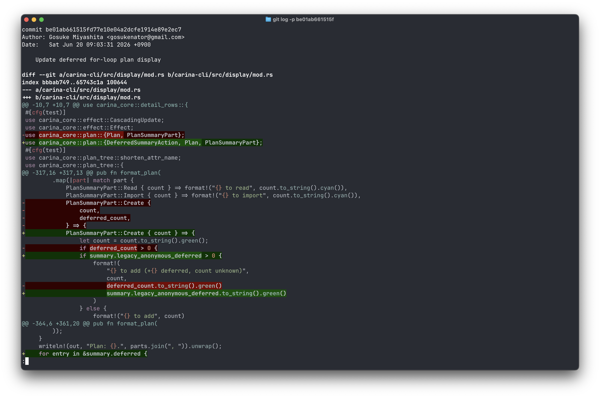

# Iris

A syntax highlighter for git output. Works as `core.pager` for all git subcommands — highlights diffs while passing non-diff output through unchanged.



iris reads unified diff from stdin, detects the language of each changed file, and prints the diff with syntax-highlighted code while preserving the familiar diff format (headers, `+`/`-` markers, and hunk ranges).

## Install

```
cargo install --path .
```

## Usage

```bash
# Highlight git diff output
git diff | iris

# Highlight git log -p output
git log -p | iris

# Use as the default git pager (all subcommands)
git config --global core.pager iris

# Or limit to diff-related subcommands only
git config --global pager.diff iris
git config --global pager.log iris
git config --global pager.show iris
```

## Configuration

iris uses the `IRIS_THEME` environment variable to select a color theme. Defaults to `base16-ocean.dark`.

```bash
export IRIS_THEME="Solarized (dark)"
```

To list available themes:

```bash
iris --list-themes
```

## License

Licensed under either of

- Apache License, Version 2.0 ([LICENSE-APACHE](LICENSE-APACHE) or http://www.apache.org/licenses/LICENSE-2.0)
- MIT license ([LICENSE-MIT](LICENSE-MIT) or http://opensource.org/licenses/MIT)

at your option.
